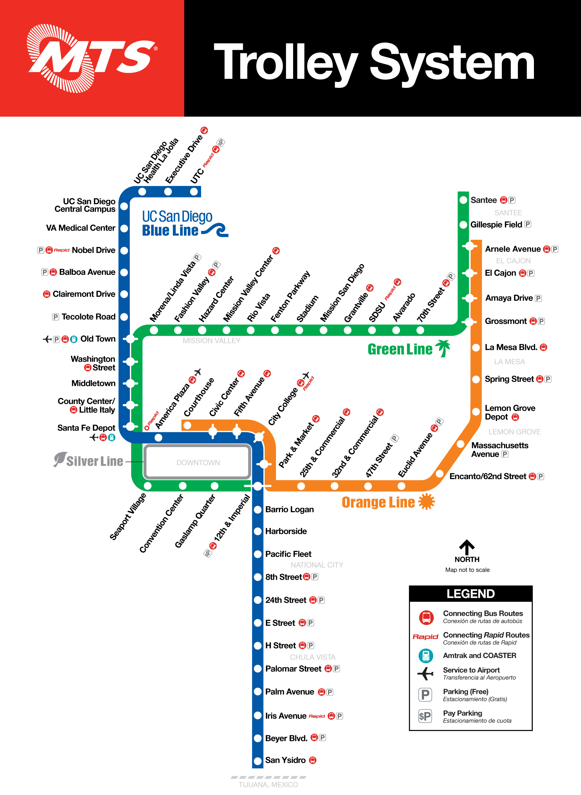

# 公車

## 公車相關 App
- [PRONTO](https://www.sdmts.com/fares/pronto) 電子票券。Triton U-Pass 註冊方式請參考[學校網站](https://transportation.ucsd.edu/commute/transit/u-pass.html)，若遇到問題，建議寄信詢問學校。
- [One bus Away](https://onebusaway.org/)可以看公車多久會來。

## 公車費用
請見 [Metropolitan Transit System (MTS)費用網頁](https://www.sdmts.com/fares-passes)。
學校附近的一般路線一次 $2.50，其他快捷路線、月票有其他方案。繳交學費後使用 Triton U-Pass 搭乘免費。

## 如何刷卡
由**前門**上車，將手機 App 內的票券出示給司機看，有些司機會要求在出示時點擊螢幕一下，畫面背景色會改變，以證明該票券不是螢幕截圖。駕駛座旁邊會有 PRONTO APP 掃碼（QR Code）機，掃碼後即可上車。(小技巧：將手機靠在掃碼機底部的小平臺，會比較容易成功)

## 如何下車
拉窗邊的一條線為下車鈴，前後門皆可下車。

## 輪椅與腳踏車
* 沒有博愛座，但通常前半區座位會是輪椅優先區，若遇到乘客有需要，司機會將該區座位收起
* 腳踏車可以放在公車頭的車架上

## 公車路線介紹

以下列出幾個常搭的公車路線，都有到學校最主要的公車站 **Gilman & Myer** (括號內是站名) 。

### 201/202 繞著學校、宿舍、超市們的環狀線
一般從校外到學校會搭202公車，從學校到校外則是搭201公車，兩台公車開的方向相反。
   * Ralphs, Trader Joe’s, Wholefoods, CVS, AT&T，La Jolla Village Square 一帶 (Nobel Dr & La Jolla Village Square Drwy) 
   * Vons 超市 (Arriba St & Regents Rd) 
   * UTC mall (UTC Transit Center) 

### 41 駕照、Fashion Valley
   * 去Clairemont DMV考駕照筆試 (從學校往 Fashion Valley 方向搭，在 Genesee Av & Derrick Dr下車) 
   * UTC mall (Genesee Av & Nobel Dr) 
   * Fashion Valley Mall  (搭到底站Fashion Valley Transit Center) 

### 30 南邊海岸、Old Town
* UTC、Coast Apartments (La Jolla Shores Dr & Horizon Way) 、La Jolla Cove (Torrey Pines Rd & Prospect St) 、Pacific Beach 到 Old Town 和 Downtown

### 150 直接開往 Old Town 與 Downtown

### 236 Mira Mesa express
* 可以搭到 Mira Mesa 的大創與韓超 H Mart。

### 101 Oceanside 開往北邊海岸
* Salk Intitute, Sanford Consortium
* 101 的公車是另一家公司 NCTD 擁有，但是別擔心， [Triton Pass 裏頭都有包含](https://www.gonctd.com/services/breeze-bus/)

# 輕軌

* [MTS Trolley](https://www.sdmts.com/schedules-real-time-maps-and-routes/trolley)
  
   費用含在 [Triton U-Pass](https://transportation.ucsd.edu/commute/transit/u-pass.html)，各站點會有刷卡機掃 [PRONTO APP](https://transportation.ucsd.edu/commute/transit/pronto-faq.html#How-do-I-get-my-discounted-UC-S) 條碼，掃完後即可上車，偶爾會遇到站務人員檢查電子票券。

   

   <figure class="image">
      
      <figcaption>MTS Trolley</figcaption>
   </figure>
   

   校園周邊站點：

   * Nobel Drive： 坐落於 La Jolla Village Square（有 Ralphs、Trader Joe’s、Whole Foods、AMC 12 電影院及多家速食店）。
   * VA Medical Center：離 Nuevo West 和 Mesa Nueva 較近。
   * UC San Diego Central Campus：校園內，臨近 Pepper Canyon。
   * Executive Drive：離 Neuvo East 較近。
   * UTC：藍線終點站，出來就是 UTC。

   刷卡小技巧：將手機緊靠掃碼機下方，會比較容易成功。
   
* NCTD [Coaster](https://www.gonctd.com/services/coaster-commuter-rail/), [Sprinter](https://www.gonctd.com/services/sprinter-hybrid-rail/)

# 去更遠的的地方
* Amtrek Pacific Surfliner 一路往北開上去，常常誤點
* 南加州都會鐵道 (Metrolink) 的橙縣線 (Orange County Line)
* 廉價巴士 [Flixbus](https://flixbus.com)，在 UTC 有設點。

